<div align="center">

# SDLC Autopilot

**Autonomous spec-driven development for Claude Code**

[](https://www.npmjs.com/package/sdlc-autopilot)
[](https://opensource.org/licenses/MIT)
[](https://github.com/gotalab/cc-sdd)
[](https://docs.anthropic.com/en/docs/claude-code)

*One word. Full SDLC. Walk away.*

</div>

---

## 3 Steps to Autopilot

**1. Install cc-sdd** (spec-driven development commands)
```bash
npx cc-sdd@latest --claude
```

**2. Install SDLC Autopilot** (the autonomous orchestrator)
```bash
npx sdlc-autopilot
```

**3. Say "SDLC" in Claude Code**
```
You: SDLC
```

That's it. The autopilot takes over -- generates missing specs, validates with dual critics, batches tasks by file, implements, reviews, fixes, and reports back when done.

---

## What It Does

- **Autonomous SDLC loop** -- generates requirements, design, and tasks if missing; validates everything; implements in batches; reviews with dual critics; auto-fixes issues; repeats until done
- **Director/Actor/Critic pattern** -- role separation prevents self-evaluation bias. The Director orchestrates, Actors implement, Critics validate
- **Dual-perspective validation** -- every artifact is reviewed by both an ADVOCATE ("can this work?") and a SKEPTIC ("what could fail?") with consensus rules
- **Intelligent task batching** -- groups tasks by file ownership to minimize agent count. 4 tasks touching the same file = 1 Actor + 1 Critic, not 12 agents
- **Context compaction survival** -- persists validation criteria and state to disk so the workflow recovers automatically when Claude's context window compresses
- **T-Mode parallel execution** -- 5 team strategies using Claude Code's native Agent Teams for parallel implementation within batches
- **Auto-fix cycles** -- up to 2 automatic fix cycles per batch before escalating to you
- **Session recovery** -- resumes from `spec.json` state after session loss or context compaction

---

## Before vs After

<table>
<tr>
<th>Manual cc-sdd (7 commands, you wait)</th>
<th>SDLC Autopilot (1 word, walk away)</th>
</tr>
<tr>
<td>

```
You: /kiro:spec-init
You: /kiro:spec-requirements
You: (review requirements)
You: /kiro:spec-design
You: (review design)
You: /kiro:spec-tasks
You: (review tasks)
You: Now implement task 1.1
You: Now implement task 1.2
You: Now implement task 1.3
...
You: Now review the implementation
You: Fix the issue
You: Review again
```

7+ commands. Manual phase transitions. You babysit every step.

</td>
<td>

```
You: SDLC
```

1 word. Walk away. Come back to a completed feature with validated requirements, reviewed design, batched implementation, dual-critic review, and auto-fixed issues.

</td>
</tr>
</table>

---

## How It Works

Here is what happens when you say "SDLC" in a project with a spec:

### Single-Agent Mode

```
Director: Starting SDLC Autopilot...

  Spec: .claude/specs/auth-module/
   - 3 phases, 8 tasks

  Step 0a: Checking artifacts...
   requirements.md  exists
   design.md        exists
   tasks.md         MISSING -> Invoking kiro:spec-tasks...
   tasks.md         generated

  Step 0b: Dual Validation...
   [Requirements ADVOCATE]  PASS - requirements implementable
   [Requirements SKEPTIC]   PASS WITH WARNINGS - minor gaps noted
    -> Consensus: PASS (both pass)

   [kiro:validate-gap]      2 areas need research (non-blocking)
   [kiro:validate-design]   GO decision

   [Tasks ADVOCATE]  PASS - tasks ready
   [Tasks SKEPTIC]   PASS - no critical gaps
    -> Consensus: PASS (both pass)

  Batching:
   BATCH A: auth/handlers.ts  (Tasks 1.1, 1.2, 1.3, 1.4)
   BATCH B: auth/routes.ts    (Task 2.1)
   BATCH C: tests/auth.test.ts (Tasks 3.1, 3.2, 3.3)

  Executing BATCH A (4 tasks, 1 file)
   [Actor] Implementing all 4 tasks...
   [Actor] Done. Self-review: all criteria addressed.
   [Critic ADVOCATE]  18/18 criteria pass
   [Critic SKEPTIC]   FAIL (missing fallback in Task 1.2)
    -> Consensus: DISAGREE - Director reviews...
    -> Director: SKEPTIC has valid point. Fixing.
   [Actor] Fixing specific issue...
   [Critic ADVOCATE]  All pass
   [Critic SKEPTIC]   All pass
    -> Consensus: PASS
    BATCH A complete

  Executing BATCH B (1 task, 1 file)
   [Actor] Implementing Task 2.1...
   [Critic ADVOCATE]  All pass
   [Critic SKEPTIC]   All pass
    -> Consensus: PASS
    BATCH B complete

  Executing BATCH C (3 tasks, 1 file)
   [Actor] Implementing test suite...
   [Critic ADVOCATE]  All pass
   [Critic SKEPTIC]   All pass
    -> Consensus: PASS
    BATCH C complete

  Final Validation:
   [Final ADVOCATE]  All FR-* requirements covered
   [Final SKEPTIC]   No gaps found
    -> Consensus: PASS

  Summary:
   - 3 batches, 8 critic calls (4 ADVOCATE + 4 SKEPTIC)
   - 1 disagreement resolved (SKEPTIC was right)
   - All 8 tasks complete
   - All FR-* requirements verified
```

> **You said 1 word. The autopilot ran 14 operations.**

### Fix Cycle Example

When the SKEPTIC catches a real issue, the autopilot fixes it automatically:

```
  [Critic SKEPTIC]  FAIL (missing fallback in Task 1.2)
   -> Evidence: auth/handlers.ts:47 - no default case for unknown role
   -> Consensus: DISAGREE

  Director reviews both reports...
   -> SKEPTIC has file:line evidence. Valid finding.

  [Actor] Fix cycle 1 of 2...
   -> Added default case at auth/handlers.ts:47
   -> Added test for unknown role edge case

  [Critic ADVOCATE]  All pass
  [Critic SKEPTIC]   All pass (previous issue resolved)
   -> Consensus: PASS
```

### T-Mode (Parallel Teams)

When `CLAUDE_CODE_EXPERIMENTAL_AGENT_TEAMS=1` is set:

```
Director: Starting SDLC Autopilot (T-Mode: Agent Teams)...

  T-Mode: ACTIVE
  Strategy selected: S2 (Impl + Test)

  Executing BATCH A (T-Mode S2: Impl + Test)
   [Lead] Spawning 2 teammates...
   [Teammate IMPL] Implementing all 4 tasks...
   [Teammate TEST] Writing tests against design interfaces...
   [Teammate IMPL]  Done (4 tasks completed)
   [Teammate TEST]  Done (test suite written)
   [Lead] Both finished. Updating barrel exports...
   [Lead] Running npm test... 14/15 pass, 1 fail (interface mismatch)
   [Lead] Fixing: validator return type mismatch
   [Lead] Running npm test... 15/15 pass
   [Critic ADVOCATE]  All pass
   [Critic SKEPTIC]   All pass
    -> Consensus: PASS
    BATCH A complete (parallel execution)
```

---

## Architecture

### Overall SDLC Flow

The complete lifecycle from trigger to completion:

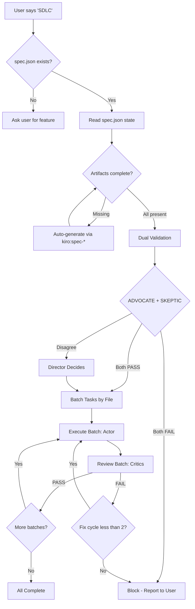

### Director / Actor / Critic Pattern

Three distinct roles prevent self-evaluation bias.

> **Why three roles? A neuroscience perspective.**
>
> The human brain doesn't evaluate its own output well. The prefrontal cortex (planning) and the anterior cingulate cortex (error monitoring) compete for the same cognitive resources -- when you're deep in implementation, your error-detection circuits are suppressed. This is why code reviews exist: *the person who wrote the code is neurologically the worst person to review it.*
>
> SDLC Autopilot encodes this into its architecture:
>
> - **Director** = prefrontal cortex: planning, sequencing, strategic decisions
> - **Actor** = motor cortex + working memory: focused execution, one batch at a time
> - **Critic** = anterior cingulate + amygdala: error detection, threat assessment, "what could go wrong?"
>
> By splitting these into separate agents with separate contexts, we eliminate the self-evaluation bias that plagues single-agent systems. The Actor never reviews its own work. The Critic never implements. The Director never touches code. This mirrors how high-performing human teams work -- and how the brain *would* work if it could run planning and error-detection in parallel without interference.

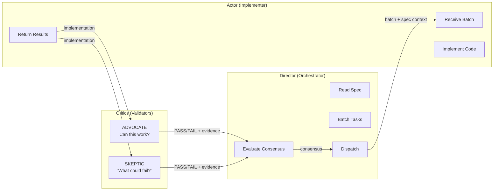

- **Director** reads the spec once, groups tasks into batches, dispatches Actors and Critics, and evaluates consensus
- **Actor** receives a batch of tasks (all touching the same files), implements them together, and self-reviews
- **Critics** (ADVOCATE + SKEPTIC) independently review the implementation from opposing perspectives

### Dual Validation Consensus

Every review dispatches two critics in parallel. Their verdicts combine via consensus rules:

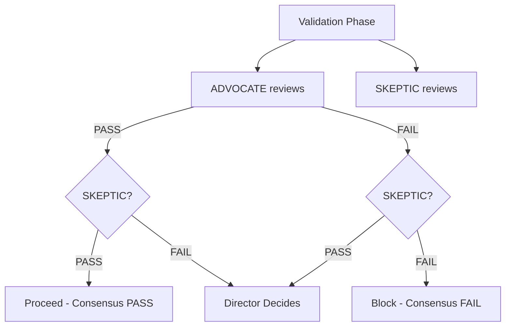

| ADVOCATE | SKEPTIC | Result |
|----------|---------|--------|
| PASS | PASS | Proceed |
| FAIL | FAIL | Block -- fix issues first |
| PASS | FAIL | Director reviews both reports, makes call |
| FAIL | PASS | Director reviews both reports, makes call |

### Task Batching

Tasks are grouped by file ownership to minimize agent overhead:

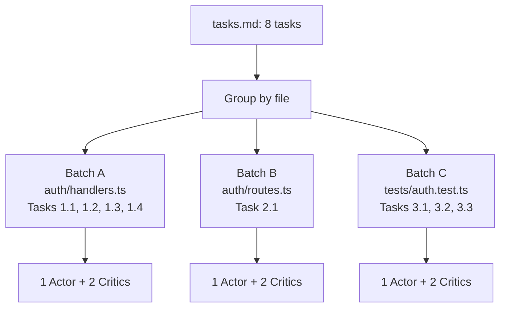

**Why batching matters:**

| Scenario | Per-Task Agents | Batched Agents | Savings |
|----------|----------------|----------------|---------|
| 4 tasks, same file | 12 | 2 | 83% |
| 10 tasks, 2 files | 30 | 4 | 87% |
| 10 tasks, 5 files | 30 | 10 | 67% |

The Actor reads the file once and implements all tasks together. The Critic reads once and checks all criteria together. The Director never re-reads the spec.

### Context Compaction Survival

Long SDLC sessions exceed Claude's context window. When compaction happens, other tools lose state. SDLC Autopilot persists critical data to disk and recovers automatically:

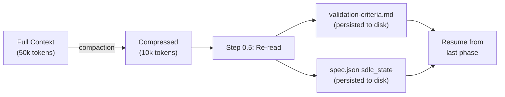

Two files survive compaction:

- **`spec.json`** -- tracks `current_phase`, `last_batch_completed`, `t_strategy`, and validation results
- **`validation-criteria.md`** -- stores phase checklists, tenet compliance, and validator prompts as the single source of truth for "what does valid mean?"

After compaction, the Director re-reads both files at Step 0.5 and resumes from the last known phase. No context is lost. No work is repeated.

---

## T-Mode: Team Strategies

> **Preview Feature:** Agent Teams is currently in preview in Claude Code. To enable it, set the environment variable before launching Claude Code:
>
> ```bash
> export CLAUDE_CODE_EXPERIMENTAL_AGENT_TEAMS=1
> ```
>
> T-Mode is entirely optional. SDLC Autopilot works fully in standard single-agent mode without it. When the feature graduates from preview, the environment variable requirement will be removed.

When Agent Teams is enabled, the Director can spawn parallel teammates within a batch. It analyzes the task graph and selects the right strategy automatically.

### Strategy Selection

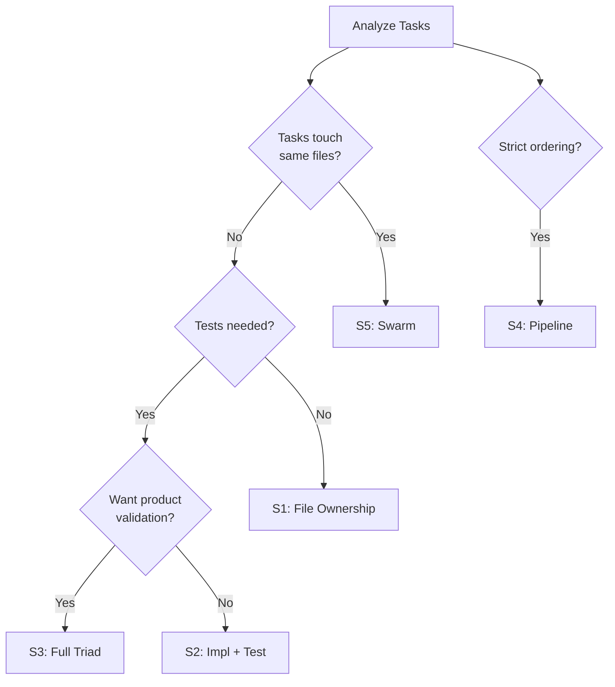

### Strategy Comparison

| Strategy | Team Shape | Parallelism | Best For |
|----------|-----------|-------------|----------|
| S1: File Ownership | N teammates, each owns files | Maximum | Independent modules |
| S2: Impl + Test | Builder + Tester pair | Medium | Quality-focused features |
| S3: Full Triad | Builder + Tester + Product | Medium | User-facing features |
| S4: Pipeline | Sequential handoff chain | Low (ordered) | Dependent tasks |
| S5: Swarm | Multiple concerns, shared files | High (coordinated) | Complex refactors |

### S1: File Ownership

Each teammate owns a set of files. Maximum parallelism, no merge conflicts.

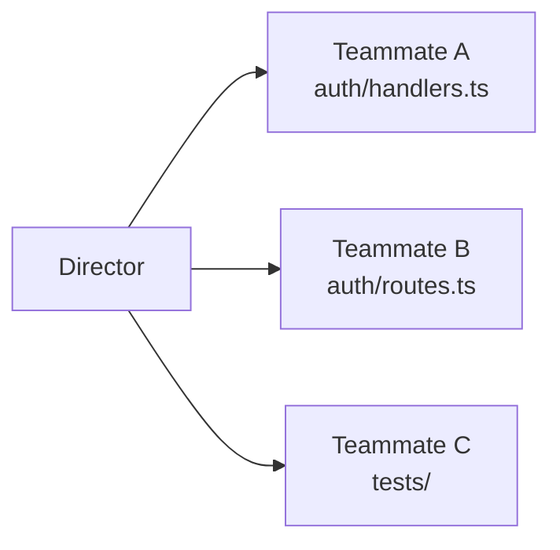

### S2: Impl + Test

One teammate builds, one writes tests. Tests are written against design interfaces, not the implementation -- catching mismatches early.

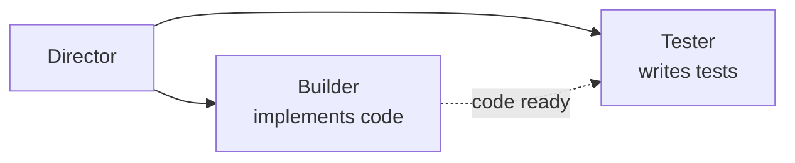

### S3: Full Triad

Builder + Tester + Product Eye. The Product Eye monitors implementation, flags UX issues, and evolves the spec with discovered requirements.

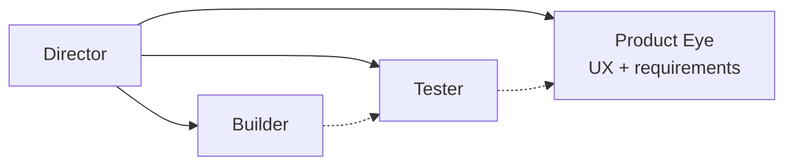

### S4: Pipeline

Sequential handoff for tasks with strict ordering: schemas first, then handlers, then tests. Each stage waits for the previous one.

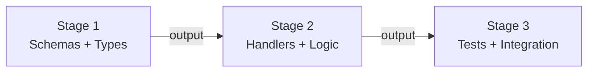

### S5: Swarm

Multiple teammates work on the same file from different angles (happy path, error paths, edge cases). High coordination overhead -- the Lead reconciles merge conflicts after.

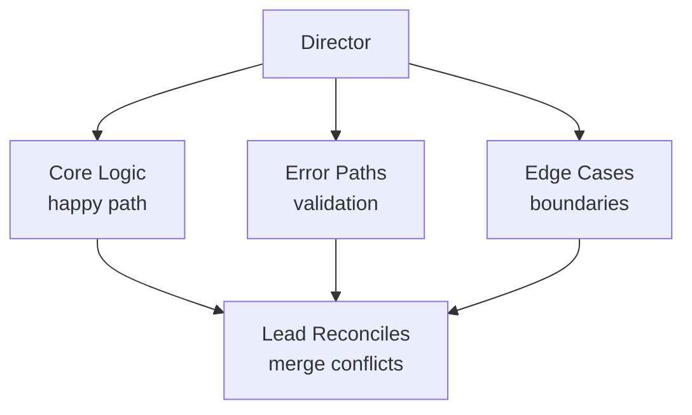

### Team Strategy Taxonomy

The five strategies form a taxonomy along two axes: **file coupling** (do teammates share files?) and **coordination overhead** (how much does the Lead need to manage?).

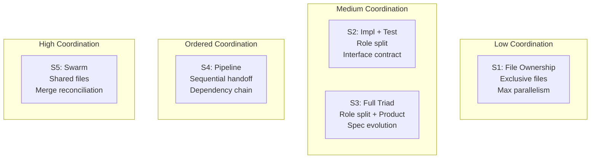

| | No shared files | Shared files |
|---|---|---|
| **Independent tasks** | S1: File Ownership | S5: Swarm |
| **Role-specialized** | S2: Impl + Test / S3: Full Triad | -- |
| **Ordered dependencies** | S4: Pipeline | -- |

The Director picks the simplest strategy that fits. S1 is preferred when file ownership can be cleanly divided. S5 is a last resort for complex single-file refactors.

### Not Just Default Claude Code Teams

> Claude Code gives you raw `TeamCreate` and `SendMessage`. That is agent spawning.
>
> SDLC Autopilot gives you **intelligent strategy selection**:
>
> - **File ownership enforcement** -- no two teammates modify the same file (S1/S4)
> - **Strategy-based team composition** -- the Director analyzes file groups, test needs, dependency chains, and spec maturity to pick the right pattern
> - **Director oversight with consensus-based promotion** -- work is only accepted when both ADVOCATE and SKEPTIC agree
> - **Automatic idle management** -- the Director assigns next work when a teammate finishes
> - **Graceful shutdown sequencing** -- Director sends `shutdown_request` to all teammates when batches complete
>
> **You do not configure teams manually.** The Director analyzes the task graph and picks the right strategy. You can override if you want, but the default is smart.

---

## Zero Config, One Command

The learning curve is near-zero. There is no YAML config file. No mandatory environment variables. No project-specific setup beyond having cc-sdd installed.

**Three things to know:**

| Step | What You Do | What Happens |
|------|------------|--------------|
| 1. **Install** | `npx sdlc-autopilot` | Skill installed to `~/.claude/skills/` |
| 2. **Trigger** | Say "SDLC" in Claude Code | Autopilot takes over |
| 3. **Review** | Read the summary when it finishes | All tasks implemented and validated |

That is the entire workflow. Everything else is automatic.

---

## FAQ

### Do I need to learn the 5 team strategies?

No. The Director picks the right strategy based on your task structure. You will be shown the top options and can accept the recommendation or override. Most users never need to think about it.

### What if I don't have cc-sdd?

The installer tells you. One command to fix:

```bash
npx cc-sdd@latest --claude
```

cc-sdd provides the Kiro spec commands (`spec-init`, `spec-requirements`, `spec-design`, `spec-tasks`) that SDLC Autopilot orchestrates. Without it, the autopilot cannot generate or read spec artifacts.

### Can I use it on existing specs?

Yes. SDLC Autopilot detects existing artifacts in your `.claude/specs/{feature}/` directory and picks up where you left off. If requirements and design exist but tasks are missing, it generates only the tasks and continues to validation and execution.

### What if the critics disagree?

When the ADVOCATE passes but the SKEPTIC fails (or vice versa), the Director reviews both reports and makes the call. In practice, SKEPTIC findings with file:line evidence are almost always valid -- the Director will trigger a fix cycle.

### What is `validation-criteria.md`?

An optional file you can create in your spec directory that defines project-specific validation rules. It survives context compaction, so validators always have access to your custom criteria even in long sessions. See `examples/validation-criteria-template.md` for a starter template.

### Can I use T-Mode?

T-Mode requires Claude Code's Agent Teams feature, which is currently in **preview**. Enable it by setting the environment variable before launching Claude Code:

```bash
export CLAUDE_CODE_EXPERIMENTAL_AGENT_TEAMS=1
```

Without this flag, SDLC Autopilot works fully in standard single-agent mode. T-Mode is optional and additive -- you lose nothing by not enabling it, and gain parallel execution when you do.

---

## Prerequisites

**Required:**

- [Claude Code CLI](https://docs.anthropic.com/en/docs/claude-code) -- the runtime environment
- [cc-sdd](https://github.com/gotalab/cc-sdd) >= 2.0.0 -- provides Kiro spec commands

**Install cc-sdd in your project:**

```bash
npx cc-sdd@latest --claude
```

This installs the Kiro spec commands (`spec-init`, `spec-requirements`, `spec-design`, `spec-tasks`, `validate-gap`, `validate-design`) to your project's `.claude/commands/kiro/` directory.

**Optional:**

- `CLAUDE_CODE_EXPERIMENTAL_AGENT_TEAMS=1` -- enables T-Mode parallel execution

---

## Compatibility Matrix

| sdlc-autopilot | cc-sdd | Claude Code | Notes |
|---------------|--------|-------------|-------|
| 1.0.x | >= 2.0.0 | Jan 2026+ | Initial release, core orchestration |
| 1.1.x (planned) | >= 2.0.0 | Jan 2026+ | Adds hooks (stop, post-edit-lint, post-edit-test) |
| 2.0.x (reserved) | >= 3.0.0 | TBD | Reserved for breaking changes |

Tested against cc-sdd v2.1.1.

---

## Installation

### Via npm (recommended)

```bash
# Global install (works across all projects)
npx sdlc-autopilot

# Project-level install (version-pinned per repo)
npx sdlc-autopilot --project
```

### Manual install

```bash
# Clone the repo
git clone https://github.com/vishnujayvel/sdlc-autopilot.git

# Copy the skill file
mkdir -p ~/.claude/skills/sdlc-autopilot
cp sdlc-autopilot/templates/skills/sdlc-autopilot/SKILL.md ~/.claude/skills/sdlc-autopilot/
```

No build step required for manual install. The SKILL.md is self-contained.

### CLI flags

| Flag | Description |
|------|-------------|
| `--project` | Install to `.claude/skills/` (project-level) instead of `~/.claude/skills/` (global) |
| `--yes`, `-y` | Skip confirmation prompts |
| `--dry-run` | Show what would be installed without writing files |
| `--version`, `-v` | Print version and exit |
| `--help`, `-h` | Print usage help |

---

## Hooks (Coming in v1.1)

Deterministic hooks for automated quality gates during SDLC execution:

- **`sdlc-stop-check.sh`** -- prevents Claude from exiting when SDLC tasks are still pending. Reads `tasks.md`, counts incomplete items, blocks exit if work remains.
- **`post-edit-lint.sh`** -- auto-formats files after Claude writes or edits. Detects your project's formatter (prettier, ruff, gofmt, etc.).
- **`post-edit-test.sh`** -- runs related tests after file modifications. Detects your test framework (jest, pytest, vitest, etc.) and runs only affected tests.

Hooks are opt-in and will be installable via `npx sdlc-autopilot --hooks`.

---

## Acknowledgments

SDLC Autopilot stands on the shoulders of [cc-sdd](https://github.com/gotalab/cc-sdd) by the Kiro spec community. They built the spec-driven development primitives -- `spec-init`, `spec-requirements`, `spec-design`, `spec-tasks` -- that make structured AI-assisted development possible in Claude Code. Without their work creating an open, composable spec format, this orchestration layer wouldn't exist. Thank you to the cc-sdd maintainers and contributors for building the foundation.

---

## License

[MIT](LICENSE) -- same as [cc-sdd](https://github.com/gotalab/cc-sdd).
