# SDLC Autopilot v2 (Director/Actor/Critic)

**THE ORCHESTRATOR** - This skill is the single entry point for all SDLC work. It internally calls Kiro skills when needed.

Efficient autonomous SDLC execution using batched implementation with the Director/Actor/Critic pattern.

**Core principle:** Batch tasks by file → one Actor per batch → one Critic per batch = minimal agent overhead.

## Workflow Stickiness (CRITICAL)

**Problem solved:** When user says "SDLC" or "go back to the spec", context was lost. We'd use individual Kiro skills instead of the autonomous workflow.

**Solution:** This skill is the ORCHESTRATOR. Kiro skills are building blocks it calls internally.

```
┌─────────────────────────────────────────────────────────────┐
│                    SDLC AUTOPILOT (THIS)                     │
│                      THE ORCHESTRATOR                        │
├─────────────────────────────────────────────────────────────┤
│  Internally calls:                                          │
│  ├── kiro:spec-requirements (if missing)                   │
│  ├── kiro:spec-design (if missing)                         │
│  ├── kiro:spec-tasks (if missing)                          │
│  ├── kiro:validate-gap (informational)                     │
│  ├── kiro:validate-design (GO/NO-GO)                       │
│  └── ADVOCATE/SKEPTIC validators (for execution)           │
│                                                             │
│  Tracks state in spec.json:                                │
│  └── "active_workflow": "sdlc-autopilot"                   │
└─────────────────────────────────────────────────────────────┘

User says "SDLC" → ALWAYS use this skill
User says "go back to spec" → ALWAYS use this skill
User says "implement the feature" → ALWAYS use this skill
```

### Workflow State Protocol

**On skill invocation:**
1. Read spec.json
2. If `active_workflow` exists and equals `sdlc-autopilot`:
   - Resume from last known phase
   - Check which artifacts exist
3. If `active_workflow` missing or different:
   - Set `active_workflow: "sdlc-autopilot"` in spec.json
   - Start fresh workflow

**State tracking in spec.json:**
```json
{
  "active_workflow": "sdlc-autopilot",
  "sdlc_state": {
    "started_at": "2026-02-04T22:30:00.000Z",
    "current_phase": "execution",  // init, validation, execution, complete
    "last_batch_completed": 2,
    "validation_results": {
      "requirements": "pass",
      "design": "pass",
      "tasks": "pass"
    }
  }
}
```

### Auto-Generation Protocol (Step 0)

**CRITICAL CHANGE:** Instead of telling user to run Kiro skills, RUN THEM AS SUB-OPERATIONS.

```
Step 0: Check & Generate Artifacts

1. Read spec.json to get spec directory
2. Check for required files:

   IF requirements.md MISSING:
     → Invoke Skill tool: kiro:spec-requirements {feature_name}
     → Wait for completion
     → Continue to next check

   IF design.md MISSING:
     → Invoke Skill tool: kiro:spec-design {feature_name}
     → Wait for completion
     → Continue to next check

   IF tasks.md MISSING:
     → Invoke Skill tool: kiro:spec-tasks {feature_name}
     → Wait for completion
     → Continue to validation

3. All artifacts exist → Proceed to validation
4. Update spec.json with sdlc_state.current_phase = "validation"
```

**Runtime Error Handling:** If any Kiro skill invocation fails (e.g., kiro:spec-requirements produces an error or is not found), output this message to the user:

```
⚠️ Kiro commands not found. SDLC Autopilot requires cc-sdd to generate specs.
Run this in your project directory:  npx cc-sdd@latest --claude
More info: https://github.com/gotalab/cc-sdd
```

Do NOT continue the SDLC loop after this error. The user must install cc-sdd first.

**This is the KEY FIX:** The skill auto-generates missing artifacts instead of asking user to do it manually.

## Quick Start: What To Do When Invoked

**FIRST ACTION (ALWAYS):**

```
1. Locate spec.json:
   - Check if user provided feature name → use {project}/.claude/specs/{feature}/spec.json
   - Check if in working directory → use .claude/specs/*/spec.json
   - If multiple specs, ask user which one

2. Read spec.json and check active_workflow field:

   IF active_workflow == "sdlc-autopilot":
     → RESUME from sdlc_state.current_phase
     → Check which artifacts exist
     → Continue where we left off

   IF active_workflow MISSING or DIFFERENT:
     → SET active_workflow = "sdlc-autopilot" in spec.json
     → START fresh from Phase 0a (artifact generation)

3. Announce: "SDLC Autopilot active for {feature_name}. Phase: {current_phase}"
```

**DECISION TREE:**

```
User invokes SDLC
       │
       ▼
 Read spec.json
       │
       ▼
┌──────┴──────┐
│ Has state?  │
└──────┬──────┘
       │
   ┌───┴───┐
   │       │
  YES      NO
   │       │
   ▼       ▼
 Resume   Start Fresh
   │       │
   └───┬───┘
       │
       ▼
 Phase 0a: Auto-generate missing artifacts (invoke Kiro skills)
       │
       ▼
 Phase 0b: Validate with ADVOCATE/SKEPTIC
       │
       ▼
 Phase 1+: Execute batches ← KEEP GOING, DON'T STOP!
```

## CRITICAL: Autonomous Execution (NO STOPPING)

**⚠️ DO NOT ask "Would you like me to proceed?" between phases!**

This is an AUTONOMOUS loop. The ONLY valid stopping points are:
1. **Validation BOTH FAIL** - Cannot proceed until fixed
2. **Max 2 fix cycles exceeded** - Report to user, stop
3. **All batches complete** - Final report, done

**WRONG pattern:**
```
Phase 0 complete → "Would you like me to proceed?" → Wait for user
```

**RIGHT pattern:**
```
Phase 0 complete → Immediately start Phase 1 → Continue until done
```

If you find yourself about to ask "Should I proceed?" or "Would you like me to...?" - STOP. That's the stickiness problem. Just proceed.

## T-Mode: Agent Teams Integration

**When `CLAUDE_CODE_EXPERIMENTAL_AGENT_TEAMS=1` is set**, the Director can spawn teammates for parallel work within a batch.

### T-Mode Detection

```
On startup, check for Teams availability:

1. Check env: CLAUDE_CODE_EXPERIMENTAL_AGENT_TEAMS=1
   - If SET → T-Mode available, announce: "T-Mode active. Parallel teammates enabled."
   - If NOT SET → Standard mode, use single Actor subagent per batch

2. Store t_mode in spec.json sdlc_state:
   "t_mode": true           // persists across compaction
   "t_strategy": "..."      // selected strategy name (persists)
```

### T-Mode Strategy Selection (CRITICAL — present to user)

**There is no single "best" swarming pattern.** The Director MUST analyze the batch and present strategy options to the user before spawning teammates.

### Strategy Decision Flowchart

```dot
digraph strategy_selection {
    rankdir=TB;
    node [shape=diamond style=filled fillcolor=lightyellow];
    edge [fontsize=10];

    start [label="T-Mode active?\nBatch ready" shape=box fillcolor=lightblue];
    q1 [label="How many\nfile groups?"];
    q2 [label="Tests needed\nor missing?"];
    q3 [label="Spec evolving?\nGaps known?"];
    q4 [label="Natural dependency\nchain?"];
    q5 [label="Single complex\nfile?"];

    s1 [label="S1: File Ownership\n(max parallelism)" shape=box fillcolor=palegreen];
    s2 [label="S2: Impl + Test\n(quality focus)" shape=box fillcolor=palegreen];
    s3 [label="S3: Full Triad\n(discovery mode)" shape=box fillcolor=palegreen];
    s4 [label="S4: Pipeline\n(ordered handoff)" shape=box fillcolor=palegreen];
    s5 [label="S5: Swarm\n(divide & conquer)" shape=box fillcolor=palegreen];
    std [label="Standard Mode\n(single Actor)" shape=box fillcolor=lightgray];

    present [label="Present top 2-3\nto user" shape=box fillcolor=orange];

    start -> q1;
    q1 -> s1 [label="3+ groups"];
    q1 -> q2 [label="1-2 groups"];
    q2 -> s2 [label="yes, interfaces clear"];
    q2 -> q3 [label="no / unclear"];
    q3 -> s3 [label="yes, exploratory"];
    q3 -> q4 [label="no, spec is solid"];
    q4 -> s4 [label="yes, A→B→C"];
    q4 -> q5 [label="no chain"];
    q5 -> s5 [label="yes, 1 big file"];
    q5 -> std [label="no → small batch"];

    s1 -> present;
    s2 -> present;
    s3 -> present;
    s4 -> present;
    s5 -> present;
}
```



### Step 2.5: How to Present Strategies

**When T-Mode is active, present options using this format (with diagrams):**

```
T-Mode Strategy Options for [Batch Name]:

━━━━━━━━━━━━━━━━━━━━━━━━━━━━━━━━━━━━━━━━━━━━━━━━━

[1] S1: File Ownership (Recommended)

    ┌─────────┐  ┌─────────┐  ┌─────────┐
    │ Actor A │  │ Actor B │  │ Actor C │
    │handlers/│  │template/│  │validatr/│
    └────┬────┘  └────┬────┘  └────┬────┘
         └───────────┬┘────────────┘
                     ▼
              ┌────────────┐
              │Lead merges │
              │shared files│
              └──────┬─────┘
                     ▼
              ┌────────────┐
              │  Critics   │
              └────────────┘

    Teammates: 3 (one per module)
    Parallelism: ███████████ HIGH
    Risk: integration at module boundaries
    Best for: independent file groups

━━━━━━━━━━━━━━━━━━━━━━━━━━━━━━━━━━━━━━━━━━━━━━━━━

[2] S2: Impl + Test

    ┌──────────────┐     ┌──────────────┐
    │ Implementer  │     │ Test Writer  │
    │              │     │              │
    │ src/*.ts     │     │ __tests__/*  │
    │ writes code  │     │ writes tests │
    └──────┬───────┘     └──────┬───────┘
           └────────┬───────────┘
                    ▼
             ┌────────────┐
             │Lead runs   │
             │test suite  │
             └──────┬─────┘
                    ▼
             ┌────────────┐
             │  Critics   │
             └────────────┘

    Teammates: 2 (builder + tester)
    Parallelism: ██████░░░░░ MEDIUM
    Risk: interface mismatch (Lead fixes)
    Best for: TDD flow, catching bugs early

━━━━━━━━━━━━━━━━━━━━━━━━━━━━━━━━━━━━━━━━━━━━━━━━━

[3] S3: Full Triad

    ┌──────────────┐ ┌──────────────┐ ┌──────────────┐
    │ Implementer  │ │ Test Writer  │ │ Product Eye  │
    │              │ │              │ │              │
    │ builds code  │ │ writes tests │ │ evolves spec │
    │              │ │              │ │ flags gaps   │
    └──────┬───────┘ └──────┬───────┘ └──────┬───────┘
           └────────────────┼────────────────┘
                            ▼
                   ┌──────────────┐
                   │Lead merges + │
                   │reconcile spec│
                   └──────┬───────┘
                          ▼
                   ┌────────────┐
                   │  Critics   │
                   └────────────┘

    Teammates: 3 (builder + tester + product)
    Parallelism: ██████░░░░░ MEDIUM
    Risk: spec drift mid-batch
    Best for: exploratory features, evolving requirements

━━━━━━━━━━━━━━━━━━━━━━━━━━━━━━━━━━━━━━━━━━━━━━━━━

[4] S4: Pipeline

    ┌────────────┐     ┌────────────┐     ┌────────────┐
    │ A: Schemas │────→│ B: Handlers│────→│ C: Tests   │
    │ & types    │     │ & logic    │     │ & integr.  │
    └────────────┘     └────────────┘     └────────────┘
     starts first       waits for A        waits for B
     ████░░░░░░░░       ░░░████░░░░        ░░░░░░████░

    Teammates: 2-3 (staggered start)
    Parallelism: ████░░░░░░░ LOW (but ordered)
    Risk: blocked if upstream is slow
    Best for: schema→handler→test dependency chains

━━━━━━━━━━━━━━━━━━━━━━━━━━━━━━━━━━━━━━━━━━━━━━━━━

[5] S5: Swarm

    ┌──────────────┐ ┌──────────────┐ ┌──────────────┐
    │ Core Logic   │ │ Error Paths  │ │ Edge Cases   │
    │ happy path   │ │ validation   │ │ boundaries   │
    │ SAME FILES   │ │ SAME FILES   │ │ SAME FILES   │
    └──────┬───────┘ └──────┬───────┘ └──────┬───────┘
           └────────────────┼────────────────┘
                            ▼
                  ┌───────────────────┐
                  │ Lead RECONCILES   │
                  │ (merge conflicts!)│
                  └─────────┬─────────┘
                            ▼
                     ┌────────────┐
                     │  Critics   │
                     └────────────┘

    Teammates: 2-3 (different concerns, same files)
    Parallelism: ██████░░░░░ MEDIUM
    Risk: ⚠️ HIGH merge conflict risk
    Best for: single complex file, major refactoring

━━━━━━━━━━━━━━━━━━━━━━━━━━━━━━━━━━━━━━━━━━━━━━━━━

[0] Standard Mode (no teammates)
    Single Actor → Critics. Safe, sequential, no coordination overhead.

Which strategy? [0-5]
```

**After user selects:**
```
4. Store choice in spec.json: sdlc_state.t_strategy = "file-ownership"
5. Apply selected strategy for all batches (unless user overrides per-batch)
```

### Strategy Selection Matrix (quick reference for Director)

| Signal | S1 File Own | S2 Impl+Test | S3 Full Triad | S4 Pipeline | S5 Swarm |
|--------|-------------|--------------|---------------|-------------|----------|
| 2+ independent file groups | **best** | ok | ok | ok | no |
| Test suite needed | ok | **best** | **best** | ok | no |
| Spec has gaps/evolving | no | ok | **best** | ok | no |
| Natural task ordering | ok | ok | ok | **best** | no |
| Single complex file | no | no | no | no | **best** |
| Small batch (1-2 tasks) | no | no | no | no | no -> Std |
| Tight file coupling | no | ok | ok | ok | caution |

### File Ownership Rules (applies to S1, partially to S4)

```
1. NO two teammates touch the same file
2. Shared files (index.ts, barrel exports, package.json) are RESERVED for Lead
3. Lead updates shared files AFTER all teammates complete
4. Each teammate gets a clear list of files they OWN
5. If ownership can't be cleanly divided → consider S2 or Standard mode
```

## Why This Pattern?

| Old Approach (v1) | New Approach (v2) | T-Mode (v2+Teams) |
|-------------------|-------------------|-------------------|
| 3 agents per task (impl + spec-review + code-review) | 2 agents per **batch** | Teammates per file group |
| 30+ agents for 10 tasks | 4-6 agents for 10 tasks | 3-4 parallel teammates |
| Agent re-reads codebase each time | Director provides context upfront | Teammates own specific files |
| Sequential only | Parallel batches when files don't overlap | Parallel WITHIN batches too |
| Manual Kiro skill invocation | Auto-generates missing artifacts | Same |
| Workflow context lost on session change | State persists in spec.json | Same + t_mode flag |

## Architecture

**Standard Mode (single Actor per batch):**
```
┌─────────────────────────────────────────────────────────────┐
│                    DIRECTOR (Main Claude)                    │
│  - Reads spec ONCE, extracts all context                    │
│  - Groups tasks by file/domain                              │
│  - Dispatches Actors with BATCHED tasks                     │
│  - Dispatches Critics to review batch output                │
│  - Coordinates fix cycles if needed                         │
└─────────────────────────────────────────────────────────────┘
         │                              │
         ▼                              ▼
┌─────────────────┐           ┌─────────────────┐
│     ACTOR       │           │     CRITIC      │
│  (Implementer)  │           │   (Reviewer)    │
│  - ALL tasks    │           │  - ALL criteria │
│  - Self-review  │           │  - Pass/fail    │
└─────────────────┘           └─────────────────┘
```

**T-Mode (parallel Actor teammates per batch):**
```
┌─────────────────────────────────────────────────────────────┐
│                 DIRECTOR / LEAD (Main Claude)                │
│  - Assigns file ownership to teammates                      │
│  - Spawns Actor teammates in natural language               │
│  - Handles shared files (index.ts, barrels) after teammates │
│  - Dispatches Critics after ALL teammates finish            │
└─────────────────────────────────────────────────────────────┘
     │           │           │                │
     ▼           ▼           ▼                ▼
┌─────────┐┌─────────┐┌─────────┐    ┌─────────────┐
│Teammate ││Teammate ││Teammate │    │   CRITIC    │
│Actor A  ││Actor B  ││Actor C  │    │ (unchanged) │
│         ││         ││         │    │ ADVOCATE +  │
│Owns:    ││Owns:    ││Owns:    │    │ SKEPTIC     │
│handlers ││templates││ tests   │    │ (subagents) │
└─────────┘└─────────┘└─────────┘    └─────────────┘
     ▲           ▲           ▲
     └───────────┴───────────┘
       Communicate via task list
```

## The Loop

```dot
digraph sdlc_v2 {
    rankdir=TB;

    subgraph cluster_init {
        label="Phase 0: Director Setup";
        "Validate spec (Step 0)" [shape=box];
        "Read spec files (requirements, design, tasks)" [shape=box];
        "TaskCreate for each task from tasks.md" [shape=box style=filled fillcolor=lightyellow];
        "Group tasks into BATCHES by file" [shape=box];
    }

    subgraph cluster_batch {
        label="Per Batch (NOT per task)";
        "TaskUpdate: batch tasks → in_progress" [shape=box style=filled fillcolor=lightyellow];
        "T-Mode + strategy selected?" [shape=diamond style=filled fillcolor=lightblue];
        "Apply strategy (S1-S5)" [shape=box style=filled fillcolor=lightblue];
        "Spawn teammates per strategy" [shape=box style=filled fillcolor=lightblue];
        "Lead merges + integrates" [shape=box style=filled fillcolor=lightblue];
        "Dispatch single ACTOR" [shape=box];
        "Actor implements all tasks, self-reviews" [shape=box];
        "Dispatch CRITIC ADVOCATE + SKEPTIC (parallel)" [shape=box];
        "Apply consensus rules" [shape=diamond];
        "ACTOR fixes specific issues" [shape=box];
        "TaskUpdate: batch tasks → completed" [shape=box style=filled fillcolor=lightyellow];
    }

    subgraph cluster_final {
        label="Completion";
        "More batches?" [shape=diamond];
        "Dispatch FINAL VALIDATOR" [shape=box];
        "TaskList to verify all complete" [shape=box style=filled fillcolor=lightyellow];
        "Report summary to user" [shape=box];
    }

    "Validate spec (Step 0)" -> "Read spec files (requirements, design, tasks)";
    "Read spec files (requirements, design, tasks)" -> "TaskCreate for each task from tasks.md";
    "TaskCreate for each task from tasks.md" -> "Group tasks into BATCHES by file";
    "Group tasks into BATCHES by file" -> "TaskUpdate: batch tasks → in_progress";

    "TaskUpdate: batch tasks → in_progress" -> "T-Mode + strategy selected?";
    "T-Mode + strategy selected?" -> "Apply strategy (S1-S5)" [label="yes"];
    "Apply strategy (S1-S5)" -> "Spawn teammates per strategy";
    "Spawn teammates per strategy" -> "Lead merges + integrates";
    "Lead merges + integrates" -> "Dispatch CRITIC ADVOCATE + SKEPTIC (parallel)";
    "T-Mode + strategy selected?" -> "Dispatch single ACTOR" [label="no"];
    "Dispatch single ACTOR" -> "Actor implements all tasks, self-reviews";
    "Actor implements all tasks, self-reviews" -> "Dispatch CRITIC ADVOCATE + SKEPTIC (parallel)";
    "Dispatch CRITIC ADVOCATE + SKEPTIC (parallel)" -> "Apply consensus rules";
    "Apply consensus rules" -> "ACTOR fixes specific issues" [label="fail/disagree (max 2x)"];
    "ACTOR fixes specific issues" -> "Dispatch CRITIC ADVOCATE + SKEPTIC (parallel)";
    "Apply consensus rules" -> "TaskUpdate: batch tasks → completed" [label="both pass"];
    "TaskUpdate: batch tasks → completed" -> "More batches?";

    "More batches?" -> "TaskUpdate: batch tasks → in_progress" [label="yes"];
    "More batches?" -> "Dispatch FINAL VALIDATOR" [label="no"];
    "Dispatch FINAL VALIDATOR" -> "TaskList to verify all complete";
    "TaskList to verify all complete" -> "Report summary to user";
}
```



## Task Primitive Integration

Use Claude Code's Task tools for tracking:

```
Director Setup:
  1. Parse tasks.md
  2. For each task: TaskCreate(subject, description, activeForm)
  3. Note task IDs for batch grouping

Per Batch:
  1. TaskUpdate(taskId, status="in_progress") for all batch tasks
  2. Dispatch Actor
  3. Dispatch Critic
  4. If pass: TaskUpdate(taskId, status="completed") for all
  5. If fail: Actor fixes, Critic re-reviews

Final:
  1. TaskList() to verify all tasks completed
  2. Report any still pending/in_progress
```

**Benefits:**
- Persistent tracking across agent calls
- User can see progress via `/tasks`
- Dependencies via `blockedBy`/`blocks`
- Resume capability if interrupted

## Batching Strategy

**Group tasks that touch the same files:**

```
Phase 1 Tasks:
  1.1 Add Role Field       → transform_snapshot.py
  1.2 Fix Timestamps       → transform_snapshot.py
  1.3 Fix Stale Threshold  → transform_snapshot.py
  1.4 Fix Duplicate Det.   → transform_snapshot.py

→ BATCH A: All 4 tasks (same file)
→ 1 Actor + 1 Critic = 2 agents (not 12)
```

**Parallel batches when files don't overlap:**

```
BATCH A: Python backend (transform_snapshot.py)
BATCH B: JavaScript UI (app.js)

→ Run A and B in PARALLEL
→ 2 Actors + 2 Critics = 4 agents total
```

### T-Mode: Batch Analysis for Strategy Selection

**When T-Mode is active, analyze each batch before execution:**

```
Standard mode: Group tasks by file → one Actor per batch
T-Mode:        Group tasks by file → analyze → select strategy → spawn teammates

For each batch, determine:
  1. How many independent file groups? (→ S1 if 2+)
  2. Are tests needed/missing? (→ S2 or S3)
  3. Is the spec evolving? (→ S3)
  4. Natural dependency chain? (→ S4)
  5. Single complex file? (→ S5)
  6. Only 1 task or tightly coupled? (→ Standard)

Present viable options to user at Step 2.5 (see Strategy Selection above).
```

## Director Protocol

### Step 0: Auto-Generate & Validate Spec (BEFORE execution)

**CRITICAL: This skill AUTO-GENERATES missing artifacts. Do NOT ask user to run Kiro skills manually.**

**Phase 0a: Artifact Generation (AUTO)**

```
1. Read spec.json to determine spec_dir and feature_name
2. Update spec.json: active_workflow = "sdlc-autopilot"
3. Check for required files and AUTO-GENERATE if missing:

   IF requirements.md MISSING:
     → Use Skill tool: kiro:spec-requirements {feature_name}
     → Note: No -y flag needed (requirements are first artifact)
     → This runs as a sub-operation (user sees it happen)
     → Continue after completion

   IF design.md MISSING:
     → Use Skill tool: kiro:spec-design {feature_name} -y
     → Auto-approves requirements, generates design
     → Continue after completion

   IF tasks.md MISSING:
     → Use Skill tool: kiro:spec-tasks {feature_name} -y
     → Auto-approves design, generates tasks
     → Continue after completion

4. All artifacts now exist → Proceed to Phase 0b (Validation)
5. Update spec.json: sdlc_state.current_phase = "validation"
```

**Phase 0b: Dual-Perspective Validation**

**CRITICAL: Each validation step uses TWO SUBAGENTS with different perspectives**

**Dual-Perspective Validation (default, configurable):**
| Role | Perspective | Focus |
|------|-------------|-------|
| **ADVOCATE** | Optimistic/Builder | "Can this work?" - feasibility, clarity, implementation path |
| **SKEPTIC** | Critical/Challenger | "What could fail?" - gaps, edge cases, ambiguities, risks |

**Consensus Rules:**
- Both PASS → Proceed
- Both FAIL → Block, fix issues
- Disagree → Director reviews both reports, makes call

```
1. All spec files now exist (generated in Phase 0a if needed)

2. Dispatch REQUIREMENTS VALIDATOR (2 subagents in parallel):
   - ADVOCATE: Uses Requirements ADVOCATE Template
   - SKEPTIC: Uses Requirements SKEPTIC Template
   - Apply consensus rules (both pass/both fail/disagree)
   → If BOTH FAIL: STOP and fix requirements first
   → If DISAGREE: Director reviews, makes call

3. Run kiro:validate-gap via subagent:
   - Analyzes implementation gap between requirements and codebase
   - Identifies missing capabilities, research needs
   - (Single subagent - informational only, non-blocking)

4. Run kiro:validate-design via subagent:
   - GO/NO-GO decision on design quality
   - Maximum 3 critical issues identified
   → If NO-GO: STOP and fix design issues first
   - (Uses Kiro's built-in validation)

5. Dispatch TASKS VALIDATOR (2 subagents in parallel):
   - ADVOCATE: Uses Tasks ADVOCATE Template
   - SKEPTIC: Uses Tasks SKEPTIC Template
   - Apply consensus rules
   → If BOTH FAIL: STOP and fix tasks first
   → If DISAGREE: Director reviews, makes call

6. All validations pass → Proceed to execution
```

**Validation Subagent Matrix:**
| Step | Validator | Subagents | Blocks Execution? |
|------|-----------|-----------|-------------------|
| Requirements | Requirements Validator | 2 (ADVOCATE + SKEPTIC) | ✅ Yes if BOTH FAIL |
| Gap Analysis | kiro:validate-gap | 1 (informational) | ⚠️ Warnings only |
| Design | kiro:validate-design | 1 (Kiro built-in) | ✅ Yes if NO-GO |
| Tasks | Tasks Validator | 2 (ADVOCATE + SKEPTIC) | ✅ Yes if BOTH FAIL |
| Per-Batch | Critic | 2 (ADVOCATE + SKEPTIC) | ✅ Yes if BOTH FAIL |
| Final | Final Validator | 2 (ADVOCATE + SKEPTIC) | Reports gaps |

**Agent Count per Validation:**
- Single-perspective (old): 1 subagent
- Dual-perspective (default): 2 subagents in parallel
- Configurable: User can opt for single-perspective to reduce overhead

### Step 0.5: Load Project-Specific Validation Criteria (CRITICAL)

**Why this matters:** Conversation compaction loses context. Validation criteria stored in files survive compaction.

```
1. Check if {spec_dir}/validation-criteria.md EXISTS
   - If YES: Read and use as THE validation source
   - If NO: Use default templates (but recommend creating one)

2. The validation-criteria.md file should contain:
   - Phase validation checklists (requirements, design, tasks, implementation)
   - Tenet compliance checklist (if project has tenets)
   - Project-specific validation rules
   - Validation Agent Prompt template

3. ALL validators MUST receive the validation-criteria.md content in their prompts
   - This is the SINGLE SOURCE OF TRUTH for "what does valid mean?"
   - Overrides default templates where specified
```

**Example validation-criteria.md structure:**
```markdown
# Validation Criteria for [Feature]

## Phase Validation
### Requirements Phase
- [ ] Checklist item 1
- [ ] Checklist item 2

### Design Phase
- [ ] Checklist item 1

### Implementation Phase
- [ ] Checklist item 1

## Tenet Compliance (if applicable)
### T0: [Tenet Name]
- [ ] Sub-check 1
- [ ] Sub-check 2

## Validation Agent Prompt
[Custom prompt for validators to use]
```

**Compaction Survival Protocol:**
```
BEFORE any validation:
  1. Read {spec_dir}/validation-criteria.md
  2. Include FULL content in validator prompts
  3. Validator checks against THIS file, not memory

AFTER conversation compaction:
  - Context is lost BUT validation-criteria.md remains
  - Director re-reads it at next Step 0.5
  - Continuity preserved
```

### Step 1: Read & Parse Spec
```
1. Read requirements.md, design.md, tasks.md
2. Read validation-criteria.md (if exists) ← NEW
3. Extract:
   - All FR-* requirements (with IDs)
   - All acceptance criteria per task
   - Task → FR-* mapping (traceability)
   - File paths mentioned
   - Tenets and validation rules (from validation-criteria.md) ← NEW
4. Store in memory (do NOT re-read during session)
```

### Step 2: Create Batches
```
1. For each task, identify primary file(s)
2. Group tasks by file
3. If batch > 5 tasks, split by phase
4. Mark batches that can run in parallel
```

### Step 2.5: T-Mode Strategy Selection (if T-Mode active)
```
1. Analyze batches: file groups, dependencies, test needs, spec maturity
2. Score strategies from Strategy Catalog against batch characteristics
3. Present top 2-3 options to user (see Strategy Selection in T-Mode section)
4. User selects strategy (or "Standard" to skip T-Mode)
5. Store in spec.json: sdlc_state.t_strategy = "[chosen]"
6. Apply strategy to all batches unless user requests per-batch override

NOTE: This is the ONE place we pause for user input in T-Mode.
      Once strategy is chosen, execution is autonomous (no more stopping).
```

### Step 3: Execute Batches
```
For each batch:
  1. Collect ALL tasks in batch
  2. Collect ALL acceptance criteria
  3. Collect relevant design context
  4. Check T-Mode + Strategy:
     IF T-Mode active AND strategy selected:
       → Apply selected strategy (see T-Mode Actor Protocol)
       → Lead coordinates per strategy rules
       → Lead merges/integrates after teammates finish
       → Lead runs test suite
     ELSE:
       → Dispatch single Actor with EVERYTHING
  5. Dispatch BOTH Critic ADVOCATE and SKEPTIC (parallel)
  6. Apply consensus rules:
     - Both PASS → Mark batch complete
     - Both FAIL → Actor fixes, re-dispatch Critics (max 2 cycles)
     - DISAGREE → Director reviews both reports, makes call
  7. Mark batch complete
```

## Actor Prompt Template

```
Task tool (general-purpose):
  description: "Implement Batch: [files]"
  prompt: |
    You are implementing MULTIPLE tasks for the same file(s).

    ## Files to Modify
    [List of files]

    ## Tasks (implement ALL of these)

    ### Task 1: [title]
    [Full task description]
    Acceptance Criteria:
    - [ ] Criterion 1
    - [ ] Criterion 2

    ### Task 2: [title]
    [Full task description]
    Acceptance Criteria:
    - [ ] Criterion 1

    [... more tasks ...]

    ## Design Context
    [Relevant sections from design.md]

    ## Instructions
    1. Read the file(s) ONCE
    2. Plan all changes together (avoid conflicting edits)
    3. Implement all tasks
    4. Self-review against ALL acceptance criteria
    5. Report summary of what you implemented

    DO NOT dispatch subagents. Implement directly.
```

## T-Mode: Actor Protocol (per strategy)

Teams are spawned via natural language — no explicit API calls. The Lead describes each teammate's role based on the selected strategy.

### S1: File Ownership — Teammate Request Template

```
"I need [N] teammates to implement this batch in parallel.

Teammate A: Implement tasks [1.1, 1.2] in [handlers/].
  Files you OWN: handlers/create-entity.ts, handlers/create-fleeting-note.ts
  DO NOT touch any files outside your ownership.
  Tasks: [paste task descriptions + acceptance criteria]
  Design context: [paste relevant design sections]
  When done, mark your tasks as completed in the task list.

Teammate B: Implement tasks [2.1] in [templates/].
  Files you OWN: templates/generators.ts, templates/index.ts
  [same structure...]

IMPORTANT: Each teammate ONLY modifies files in their ownership list.
Shared files will be updated by me (Lead) after you all finish."
```

### S2: Impl + Test — Teammate Request Template

```
"I need 2 teammates working in parallel on this batch.

Teammate IMPL: Implement all tasks for this batch.
  Files you OWN: [list all source files]
  Tasks: [paste ALL task descriptions + acceptance criteria]
  Design context: [paste relevant design sections]
  Write the implementation code. DO NOT write tests.
  When done, mark your tasks as completed in the task list.

Teammate TEST: Write test cases for all tasks in this batch.
  Files you OWN: [list all test files, e.g. __tests__/*.test.ts]
  Tasks: Write tests covering these acceptance criteria:
    [paste ALL acceptance criteria from all tasks]
  Design context: [paste interfaces/contracts from design.md]
  Write tests against the DESIGNED interfaces (not the implementation).
  You can read source files but do NOT modify them.
  When done, mark your tasks as completed in the task list.

Both start simultaneously. I (Lead) will run the full test suite
after you both finish and fix any integration gaps."
```

### S3: Impl + Test + Product — Teammate Request Template

```
"I need 3 teammates working on this batch.

Teammate IMPL: [same as S2 IMPL above]

Teammate TEST: [same as S2 TEST above]

Teammate PRODUCT: Evolve the spec based on implementation discoveries.
  Files you OWN: {spec_dir}/requirements.md, {spec_dir}/design.md
  Your job:
  1. Monitor implementation progress via the task list
  2. Read the source code as teammates write it
  3. Identify edge cases, UX issues, or spec gaps
  4. Update requirements.md with discovered requirements (mark as [DISCOVERED])
  5. Update design.md with revised designs if needed
  6. Create new tasks via TaskCreate for anything the current batch doesn't cover
  7. Flag blocking issues to me (Lead) immediately
  When done, summarize all spec changes in the task list.

IMPL and TEST start immediately. PRODUCT monitors and evolves.
I (Lead) will reconcile spec changes before the next batch."
```

### S4: Pipeline — Teammate Request Template

```
"I need [N] teammates working in a pipeline for this batch.

Teammate A (schemas/types): Start IMMEDIATELY.
  Files you OWN: [schema/type files]
  Tasks: [schema/type tasks]
  When done, mark tasks completed. Teammate B is waiting on your interfaces.

Teammate B (handlers/logic): Start when Teammate A's tasks show 'completed'.
  Files you OWN: [handler/logic files]
  Tasks: [handler tasks]
  Read Teammate A's files for types/interfaces. DO NOT modify them.
  When done, mark tasks completed.

Teammate C (tests/integration): Start when Teammate B's tasks show 'completed'.
  Files you OWN: [test files]
  Tasks: [test tasks]
  Read source files but DO NOT modify them.
  When done, mark tasks completed.

Pipeline: A → B → C. Each waits for the previous to finish.
I (Lead) will merge shared files and run the full suite after C completes."
```

### Teammate Coordination (all strategies)

```
1. Lead creates TaskCreate for each task (if not already created)
2. Lead requests teammates per selected strategy template
3. Teammates work per their assigned role
4. Teammates use TaskUpdate to mark tasks completed
5. Lead monitors TaskList for all teammate tasks → completed
6. Lead updates shared files (barrel exports, index.ts, etc.)
7. Lead runs full test suite to verify integration
8. Lead dispatches Critics (ADVOCATE + SKEPTIC) on ALL changed files
```

### Lead Post-Teammate Checklist

```
After all teammates complete:
  1. TaskList() → verify all teammate tasks are "completed"
  2. If S3 (Product): review spec changes, reconcile with current batch
  3. Read shared files that may need updates (index.ts, barrel exports)
  4. Update shared files to integrate teammate work
  5. Run test suite: npm test / pytest / etc.
  6. If tests fail: Lead fixes integration issues directly
  7. Dispatch Critics on the FULL batch (all files, all teammates' work)
```

### Fallback: When to Abort T-Mode

```
Abort T-Mode and fall back to standard Actor if:
  - File ownership can't be cleanly divided (S1)
  - Tasks have data dependencies that don't fit a pipeline (S4)
  - Only 1 task in the batch
  - Teammate fails repeatedly (2+ failures on same task)
  - User requests Standard mode
```

## Critic Prompt Template

**Dispatch TWO subagents with different perspectives:**

**CRITICAL: Include validation-criteria.md content in EVERY validator prompt!**

### ADVOCATE (Critic)
```
Task tool (general-purpose):
  description: "Critic ADVOCATE review: [files]"
  prompt: |
    You are the ADVOCATE Critic reviewing with an OPTIMISTIC lens.
    Your role: Find reasons the implementation IS correct and DOES meet criteria.

    ## Project Validation Criteria (SOURCE OF TRUTH)
    [PASTE FULL CONTENT of {spec_dir}/validation-criteria.md HERE]

    ## Files to Verify
    [List of files]

    ## ALL Acceptance Criteria to Check
    [List all criteria from all tasks in batch]

    ## ADVOCATE Instructions
    1. Read the actual code (DO NOT trust any report)
    2. For each criterion IN VALIDATION-CRITERIA.MD, look for evidence it IS satisfied
    3. For each TENET (if defined), verify compliance
    4. Note implementation strengths and good patterns
    5. Cite file:line as evidence of compliance

    Report:
    - ✅ PASS: [list criteria met with file:line evidence]
    - ⚠️ PASS WITH NOTES: [criteria met with minor observations]
    - ❌ FAIL: [criteria clearly not met - specific gaps only]
    - 📋 FR-* COVERED: [list FR-IDs verified by this batch]
    - 📋 TENETS VERIFIED: [list tenet IDs if applicable]
```

### SKEPTIC (Critic)
```
Task tool (general-purpose):
  description: "Critic SKEPTIC review: [files]"
  prompt: |
    You are the SKEPTIC Critic reviewing with a CRITICAL lens.
    Your role: Find gaps, bugs, and criteria NOT met.

    ## Project Validation Criteria (SOURCE OF TRUTH)
    [PASTE FULL CONTENT of {spec_dir}/validation-criteria.md HERE]

    ## Files to Verify
    [List of files]

    ## ALL Acceptance Criteria to Check
    [List all criteria from all tasks in batch]

    ## SKEPTIC Instructions
    1. Read the actual code (DO NOT trust any report)
    2. For each criterion IN VALIDATION-CRITERIA.MD, look for evidence it is NOT satisfied
    3. For each TENET (if defined), look for violations
    4. Check edge cases, error handling, missing logic
    5. Cite file:line as evidence of gaps

    Report:
    - ✅ PASS: [no gaps found - list verification evidence]
    - ⚠️ PASS WITH WARNINGS: [minor gaps that don't block]
    - ❌ FAIL: [criteria not met with file:line evidence]
      - Criterion X: Not satisfied because [reason + evidence]
      - Tenet TX violated: [specific violation]
      - Missing edge case: [specific gap]
    - 📋 FR-* AT RISK: [FR-IDs that may not be fully satisfied]
    - 📋 TENETS VIOLATED: [list tenet IDs with violations]
```

## Requirements Validator Template (MISSING FROM KIRO)

**Dispatch TWO subagents with different perspectives:**

**CRITICAL: Include validation-criteria.md content if it exists!**

### ADVOCATE (Requirements)
```
Task tool (general-purpose):
  description: "Requirements ADVOCATE review"
  prompt: |
    You are the ADVOCATE reviewing requirements.md with an OPTIMISTIC lens.
    Your role: Find reasons this spec CAN work and IS implementable.

    ## Project Validation Criteria (if exists)
    [PASTE FULL CONTENT of {spec_dir}/validation-criteria.md HERE - especially "Requirements Phase" section]

    ## Requirements Document
    [Full content of requirements.md]

    ## ADVOCATE Checklist (look for strengths)

    ### 1. Implementability
    - Can each FR-* be translated to concrete code?
    - Is there a clear path from requirement to implementation?
    - Are the requirements technically feasible?

    ### 2. Clarity
    - Are requirements understandable to a developer?
    - Is the intent clear even if wording could be better?
    - Can ambiguities be resolved with reasonable assumptions?

    ### 3. Completeness
    - Are the core user needs captured?
    - Is there enough to start implementation?

    ### 4. Project-Specific (from validation-criteria.md)
    [Check each item in "Requirements Phase" section]

    ## Report
    - ✅ PASS: Requirements are implementable with [list strengths]
    - ⚠️ PASS WITH NOTES: Minor gaps that won't block [list notes]
    - ❌ FAIL: Fundamental gaps prevent implementation [list blockers]
    - 📋 VALIDATION-CRITERIA CHECKS: [status of each project-specific check]
```

### SKEPTIC (Requirements)
```
Task tool (general-purpose):
  description: "Requirements SKEPTIC review"
  prompt: |
    You are the SKEPTIC reviewing requirements.md with a CRITICAL lens.
    Your role: Find gaps, ambiguities, and risks that could cause failure.

    ## Project Validation Criteria (if exists)
    [PASTE FULL CONTENT of {spec_dir}/validation-criteria.md HERE - especially "Requirements Phase" section]

    ## Requirements Document
    [Full content of requirements.md]

    ## SKEPTIC Checklist (look for weaknesses)

    ### 1. Structure & Format Gaps
    - [ ] Missing Goal section?
    - [ ] Inconsistent FR-*/NFR-* numbering?
    - [ ] Requirements without acceptance criteria?

    ### 2. Completeness Gaps
    - [ ] Missing edge cases or error handling?
    - [ ] TBD or placeholder text remaining?
    - [ ] Security/performance blindspots?

    ### 3. Quality Issues
    - [ ] Vague requirements ("should work", "handle errors")?
    - [ ] Untestable requirements (no pass/fail criteria)?
    - [ ] Conflicting requirements?

    ### 4. Traceability Risks
    - [ ] Orphan requirements (can't be implemented)?
    - [ ] Missing dependencies between requirements?

    ### 5. Project-Specific (from validation-criteria.md)
    [Check each item in "Requirements Phase" section - look for violations]

    ## Report
    - ✅ PASS: No critical gaps found [minor notes if any]
    - ⚠️ PASS WITH WARNINGS: Gaps exist but manageable [list with severity]
    - ❌ FAIL: Critical gaps must be fixed [list with line references]
    - 📋 VALIDATION-CRITERIA VIOLATIONS: [list any project-specific check failures]
```

## Tasks Validator Template (MISSING FROM KIRO)

**Dispatch TWO subagents with different perspectives:**

**CRITICAL: Include validation-criteria.md content if it exists!**

### ADVOCATE (Tasks)
```
Task tool (general-purpose):
  description: "Tasks ADVOCATE review"
  prompt: |
    You are the ADVOCATE reviewing tasks.md with an OPTIMISTIC lens.
    Your role: Find reasons these tasks CAN be implemented successfully.

    ## Project Validation Criteria (if exists)
    [PASTE FULL CONTENT of {spec_dir}/validation-criteria.md HERE - especially "Tasks Phase" section]

    ## Tasks Document
    [Full content of tasks.md]

    ## Requirements Document (for traceability)
    [Full content of requirements.md]

    ## ADVOCATE Checklist (look for strengths)

    ### 1. Clarity & Actionability
    - Are tasks clear enough for an implementer to start?
    - Is the expected outcome understandable?
    - Can acceptance criteria be verified?

    ### 2. Coverage
    - Do tasks cover the core requirements?
    - Is the phasing logical for incremental delivery?
    - Are dependencies between tasks reasonable?

    ### 3. Feasibility
    - Are tasks appropriately sized?
    - Is the scope achievable?

    ### 4. Project-Specific (from validation-criteria.md)
    [Check each item in "Tasks Phase" section]

    ## Report
    - ✅ PASS: Tasks are ready for implementation [list strengths]
    - ⚠️ PASS WITH NOTES: Minor gaps won't block [list notes]
    - ❌ FAIL: Tasks cannot be implemented [list blockers]
    - 📋 VALIDATION-CRITERIA CHECKS: [status of each project-specific check]
```

### SKEPTIC (Tasks)
```
Task tool (general-purpose):
  description: "Tasks SKEPTIC review"
  prompt: |
    You are the SKEPTIC reviewing tasks.md with a CRITICAL lens.
    Your role: Find gaps that could cause implementation failure.

    ## Project Validation Criteria (if exists)
    [PASTE FULL CONTENT of {spec_dir}/validation-criteria.md HERE - especially "Tasks Phase" section]

    ## Tasks Document
    [Full content of tasks.md]

    ## Requirements Document (for traceability)
    [Full content of requirements.md]

    ## SKEPTIC Checklist (look for weaknesses)

    ### 1. Structure Gaps
    - [ ] Tasks missing titles or descriptions?
    - [ ] Tasks without acceptance criteria?
    - [ ] Missing progress tracking table?

    ### 2. Acceptance Criteria Issues
    - [ ] Vague criteria ("works correctly", "handles errors")?
    - [ ] Missing expected inputs/outputs?
    - [ ] Edge cases not covered?

    ### 3. Traceability Gaps
    - [ ] Tasks not mapped to any FR-*?
    - [ ] FR-* requirements with no covering task?
    - [ ] Orphan tasks (no clear purpose)?

    ### 4. Implementability Risks
    - [ ] Tasks too large (should be split)?
    - [ ] Circular dependencies?
    - [ ] Blocked tasks with no resolution?

    ### 5. Project-Specific (from validation-criteria.md)
    [Check each item in "Tasks Phase" section - look for violations]

    ## Report
    - ✅ PASS: No critical gaps [minor notes if any]
    - ⚠️ PASS WITH WARNINGS: Gaps manageable [list with severity]
    - ❌ FAIL: Critical gaps must be fixed
      - Missing acceptance criteria: [list tasks]
      - Uncovered requirements: [list FR-*]
      - Vague criteria: [list specific issues]
    - 📋 VALIDATION-CRITERIA VIOLATIONS: [list any project-specific check failures]
```

## Final Validator Template

**Dispatch TWO subagents with different perspectives:**

**CRITICAL: Include validation-criteria.md content - this is the FINAL check against ALL criteria!**

### ADVOCATE (Final)
```
Task tool (general-purpose):
  description: "Final ADVOCATE validation"
  prompt: |
    You are the ADVOCATE Final Validator with an OPTIMISTIC lens.
    Your role: Confirm requirements ARE satisfied and implementation IS complete.

    ## Project Validation Criteria (SOURCE OF TRUTH)
    [PASTE FULL CONTENT of {spec_dir}/validation-criteria.md HERE]
    - Check "Implementation Phase" section
    - Check ALL tenet compliance items
    - This is the FINAL validation against stored criteria

    ## Requirements from requirements.md
    [List ALL FR-* requirements]

    ## Tasks Completed
    [List all completed tasks with their FR-* mappings]

    ## ADVOCATE Instructions
    1. For EACH FR-* requirement, find evidence it IS covered
    2. For EACH tenet in validation-criteria.md, verify compliance
    3. Read code to verify implementation EXISTS
    4. Note implementation quality and completeness
    5. Cite file:line evidence for each FR-* and tenet

    Report:
    - ✅ ALL REQUIREMENTS MET: [FR-* → file:line evidence mapping]
    - ⚠️ MOSTLY COMPLETE: [list FR-* with partial coverage + notes]
    - ❌ INCOMPLETE: [FR-* clearly not implemented]
    - 🎯 IMPLEMENTATION STRENGTHS: [notable quality aspects]
    - 📋 TENET COMPLIANCE: [all tenets verified with evidence]
    - 📋 VALIDATION-CRITERIA: [all checks from validation-criteria.md]
```

### SKEPTIC (Final)
```
Task tool (general-purpose):
  description: "Final SKEPTIC validation"
  prompt: |
    You are the SKEPTIC Final Validator with a CRITICAL lens.
    Your role: Find requirements NOT satisfied and implementation gaps.

    ## Project Validation Criteria (SOURCE OF TRUTH)
    [PASTE FULL CONTENT of {spec_dir}/validation-criteria.md HERE]
    - Check "Implementation Phase" section for violations
    - Check ALL tenet compliance items for violations
    - This is the FINAL validation against stored criteria

    ## Requirements from requirements.md
    [List ALL FR-* requirements]

    ## Tasks Completed
    [List all completed tasks with their FR-* mappings]

    ## SKEPTIC Instructions
    1. For EACH FR-* requirement, look for evidence it is NOT covered
    2. For EACH tenet in validation-criteria.md, look for violations
    3. Check for partial implementations, missing edge cases
    4. Identify orphan requirements (FR-* with no task)
    5. Identify orphan tasks (tasks covering no FR-*)
    6. Check for regressions or conflicts between implementations

    Report:
    - ✅ PASS: All requirements verified with evidence
    - ⚠️ PASS WITH WARNINGS: Minor gaps [list with severity]
    - ❌ FAIL: Requirements not met
      - Missing: [list uncovered FR-*]
      - Partial: [list FR-* with incomplete implementation]
      - Orphan tasks: [tasks not linked to requirements]
      - Tenet violations: [list tenet IDs with violations]
    - ⚠️ RISKS: [potential issues to monitor]
    - 📋 VALIDATION-CRITERIA VIOLATIONS: [any failures from validation-criteria.md]
```

## Efficiency Gains

| Scenario | v1 Agents | v2 Agents | v2+T-Mode | Savings |
|----------|-----------|-----------|-----------|---------|
| 4 tasks, same file | 12 | 2 | 2 (no gain) | 83% |
| 10 tasks, 2 files | 30 | 4 | 4 (parallel) | 87% |
| 10 tasks, 5 files | 30 | 10 | 5 teammates + 2 critics | 77% |
| 8 tasks, 3 file groups | 24 | 6 | 3 teammates + 2 critics | 79% |

**Token savings:**
- Actor reads file ONCE, implements ALL tasks
- Critic reads file ONCE, checks ALL criteria
- Director never re-reads spec

**T-Mode additional gains:**
- Teammates work in parallel (wall-clock time reduced by ~Nx for N teammates)
- Each teammate has smaller context (only their owned files)
- No file contention (exclusive ownership prevents merge conflicts)

## Red Flags

**Never:**
- Dispatch per-task agents (use batches)
- Have Actor dispatch sub-agents (defeats purpose)
- Skip Critic review (still needed for bias prevention)
- Run parallel batches that touch same file
- Let two teammates modify the same file (T-Mode)
- Use T-Mode for Critics (ADVOCATE/SKEPTIC are already parallel subagents)
- Use T-Mode for spec generation (Phase 0a — Lead handles directly)

**Fix cycles:**
- Max 2 Critic cycles per batch
- If still failing after 2 cycles, report to user
- Don't infinite loop

## Example Execution

```
Director: Starting SDLC Autopilot v2 (Dual-Perspective Mode)...

📋 Spec: .claude/specs/my-feature/
   - 4 phases, 11 tasks

🔍 Step 0: Validating Spec...
   [Requirements ADVOCATE] ✅ PASS - requirements implementable
   [Requirements SKEPTIC] ⚠️ PASS WITH WARNINGS - minor gaps noted
   → Consensus: PASS (both pass)

   [kiro:validate-gap] ⚠️ 2 areas need research (non-blocking)
   [kiro:validate-design] ✅ GO decision

   [Tasks ADVOCATE] ✅ PASS - tasks ready for implementation
   [Tasks SKEPTIC] ✅ PASS - no critical gaps
   → Consensus: PASS (both pass)

📦 Batching:
   BATCH A: transform_snapshot.py (Tasks 1.1-1.4, 3.1-3.2)
   BATCH B: app.js (Tasks 2.3)
   BATCH C: validate_pipeline.py (Task 4.1)
   BATCH D: tests (Task 4.2)

🔄 Executing BATCH A (6 tasks, 1 file)
   [Actor] Implementing all 6 tasks...
   [Actor] Done. Self-review: all criteria addressed.
   [Critic ADVOCATE] ✅ 18/18 criteria pass
   [Critic SKEPTIC] ❌ 1 fail (missing fallback in Task 1.2)
   → Consensus: DISAGREE - Director reviews...
   → Director: SKEPTIC has valid point, fixing
   [Actor] Fixing specific issue...
   [Critic ADVOCATE] ✅ All pass
   [Critic SKEPTIC] ✅ All pass
   → Consensus: PASS
   ✅ BATCH A complete

🔄 Executing BATCH B (1 task, 1 file)
   [Actor] Implementing Task 2.3...
   [Critic ADVOCATE] ✅ All criteria pass
   [Critic SKEPTIC] ✅ All criteria pass
   → Consensus: PASS
   ✅ BATCH B complete

... (continues)

🏁 Final Validation:
   [Final ADVOCATE] ✅ All FR-* requirements covered
   [Final SKEPTIC] ✅ No gaps found
   → Consensus: PASS

📊 Summary:
   - 4 batches, 16 critic calls (8 ADVOCATE + 8 SKEPTIC)
   - 1 disagreement resolved (Batch A, SKEPTIC was right)
   - All 11 tasks complete
   - All FR-* requirements verified
```

### T-Mode Example Execution (S2: Impl + Test)

```
Director: Starting SDLC Autopilot v2 (T-Mode: Agent Teams)...

📋 Spec: .claude/specs/my-feature/
   - 3 phases, 9 tasks
   - T-Mode: ACTIVE (CLAUDE_CODE_EXPERIMENTAL_AGENT_TEAMS=1)

🔍 Step 0: Validating Spec... (same as standard mode)
   [All validations PASS]

📦 Batching:
   BATCH A: Task CRUD (handlers, validators, templates — 6 tasks)
   BATCH B: Integration wiring (index.ts, server.ts — 3 tasks)

🎯 Step 2.5: T-Mode Strategy Selection
   Analyzing batch characteristics...
   - BATCH A: 3 file groups, clear interfaces in design, tests needed
   - BATCH B: 2 tightly-coupled files, sequential

   T-Mode Strategy Options for BATCH A:

    [1] File Ownership
        3 teammates: handlers/, validators/, templates/
        + Maximum parallelism (3x speedup)
        - Integration risk at boundaries

    [2] Impl + Test (Recommended)
        2 teammates: Implementer (all source) + Test Writer (all tests)
        + Tests written against design interfaces = better coverage
        + Catches mismatches early
        - 2x speedup (not 3x)

    [3] Standard Mode
        Single Actor, sequential
        + Safest, no coordination overhead
        - Slowest

   → User selects: [2] Impl + Test
   → Stored: sdlc_state.t_strategy = "impl-test"
   → BATCH B: too coupled → Standard mode

🔄 Executing BATCH A (T-Mode S2: Impl + Test)
   [Lead] Spawning 2 teammates...
   [Teammate IMPL] Implementing all 6 tasks... ⏳
   [Teammate TEST] Writing tests against design interfaces... ⏳
   [Teammate IMPL] ✅ Done (6 tasks completed)
   [Teammate TEST] ✅ Done (test suite written)
   [Lead] Both finished. Updating barrel exports...
   [Lead] Running npm test... 14/15 pass, 1 fail (interface mismatch)
   [Lead] Fixing: validator return type doesn't match test expectation
   [Lead] Running npm test... ✅ 15/15 pass
   [Critic ADVOCATE] ✅ All criteria pass
   [Critic SKEPTIC] ✅ All criteria pass
   → Consensus: PASS
   ✅ BATCH A complete

🔄 Executing BATCH B (Standard mode)
   [Actor] Implementing 3 wiring tasks...
   [Critic ADVOCATE] ✅ All pass
   [Critic SKEPTIC] ✅ All pass
   → Consensus: PASS
   ✅ BATCH B complete

🏁 Final Validation: PASS

📊 Summary:
   - Strategy: Impl + Test (S2) for BATCH A, Standard for BATCH B
   - 2 teammates + 1 actor + 4 critic calls
   - 1 integration fix by Lead (interface mismatch)
   - All 9 tasks complete, all FR-* verified
```

## Session Persistence & Compaction Survival

**Problem:** Long SDLC sessions often hit conversation compaction. Context is lost.

**Solution:** Store validation criteria in the spec directory. File persists even when context is lost.

### The Pattern

```
┌────────────────────────────────────────────────────────────────┐
│                 CONVERSATION COMPACTION SURVIVAL               │
├────────────────────────────────────────────────────────────────┤
│                                                                │
│   BEFORE COMPACTION:                                           │
│   ┌──────────────────┐                                         │
│   │ Director Memory  │ ← "I know the tenets, I know the rules" │
│   │ validation rules │                                         │
│   │ tenets T0-T15    │                                         │
│   └──────────────────┘                                         │
│                                                                │
│   AFTER COMPACTION:                                            │
│   ┌──────────────────┐                                         │
│   │ Director Memory  │ ← "Context lost! What were the rules?"  │
│   │ (empty)          │                                         │
│   └──────────────────┘                                         │
│            │                                                   │
│            ▼                                                   │
│   ┌──────────────────────────────────────┐                     │
│   │ {spec_dir}/validation-criteria.md    │ ← FILE PERSISTS!    │
│   │ - Phase validation checklists        │                     │
│   │ - Tenet compliance (T0-T15)          │                     │
│   │ - Validation Agent Prompt            │                     │
│   │ - Project-specific rules             │                     │
│   └──────────────────────────────────────┘                     │
│            │                                                   │
│            ▼                                                   │
│   Director re-reads file at Step 0.5 → CONTINUITY RESTORED     │
│                                                                │
└────────────────────────────────────────────────────────────────┘
```

### Creating validation-criteria.md

**When:** During or after requirements phase, BEFORE running SDLC

**Where:** `{spec_dir}/validation-criteria.md`

**Contents:**
1. **Phase Validation Checklists** - What to check after requirements, design, tasks, implementation
2. **Tenet Compliance Checklist** - Project-specific tenets (T0, T1, T2...)
3. **Validation Agent Prompt** - Custom instructions for validators
4. **SDLC Loop Integration** - How validators should use this file

**Template:**
```markdown
# Validation Criteria for [Feature Name]

## Phase Validation

### Requirements Phase
After generating requirements.md, verify:
- [ ] Criterion 1
- [ ] Criterion 2

### Design Phase
After generating design.md, verify:
- [ ] Criterion 1

### Tasks Phase
After generating tasks.md, verify:
- [ ] Each task is tagged with relevant tenet(s)
- [ ] Criterion 2

### Implementation Phase
For each implementation PR/commit, verify:
- [ ] Criterion 1
- [ ] Criterion 2

## Tenet Compliance Checklist

### T0: [Tenet Name]
```
□ Sub-check 1
□ Sub-check 2
```

### T1: [Tenet Name]
```
□ Sub-check 1
```

## Validation Agent Prompt

Use this prompt when running tenet validation:

```
You are the Tenet Validation Agent for [Feature].

Your task: Validate [ARTIFACT_TYPE] against the tenets above.

Input:
- Artifact to validate: [ARTIFACT_PATH]
- Tenets: See "Tenet Compliance Checklist" above

Process:
1. Read the artifact
2. For each tenet, check compliance
3. Report findings

Output format:
| Tenet | Status | Evidence/Issue |
|-------|--------|----------------|
| T0 | ✅/❌/⚠️ | [specific evidence] |
...
```

## SDLC Loop Integration

```yaml
phase_complete:
  - artifact: requirements.md
    validation: "Check Requirements Phase section above"
  - artifact: design.md
    validation: "Check Design Phase section above"
  - artifact: tasks.md
    validation: "Check Tasks Phase section above"
  - artifact: implementation
    validation: "Full tenet checklist + Implementation Phase"
```
```

### Why This Works

1. **Files persist** - Even when conversation context is lost, files remain
2. **Single source of truth** - All validators read the SAME file
3. **Project-specific** - Each spec has its own validation rules
4. **Auditable** - You can see exactly what criteria were used
5. **Version controlled** - Changes to criteria are tracked

## Integration

**Required:** Kiro spec with requirements.md, design.md, tasks.md

**Optional but RECOMMENDED:** validation-criteria.md for session persistence

**Kiro Validation Skills (use these!):**
- `kiro:validate-gap` - Run before design to analyze implementation gaps
- `kiro:validate-design` - Run before implementation for GO/NO-GO decision
- `kiro:spec-requirements` - Generate requirements if missing
- `kiro:spec-design` - Generate design if missing
- `kiro:spec-tasks` - Generate tasks if missing

**Kiro + Project Criteria Integration:**
```
1. Kiro validators run their built-in checks
2. SDLC validators ALSO check validation-criteria.md
3. Both must pass for approval
4. validation-criteria.md augments (not replaces) Kiro validation
```

**Uses:** Task tool with general-purpose subagent type

**Complements:**
- `superpowers:test-driven-development` (Actors should follow TDD)
- `superpowers:verification-before-completion` (Critic verifies)

## Full SDLC Flow (ORCHESTRATED)

**IMPORTANT: Use sdlc-autopilot as the ENTRY POINT. It calls Kiro skills internally.**

```
USER: "Build this feature" / "SDLC" / "implement the spec"
                    │
                    ▼
          ┌─────────────────────┐
          │   sdlc-autopilot    │  ← THE ORCHESTRATOR
          │  (invoke this one)  │
          └─────────┬───────────┘
                    │
    ┌───────────────┼───────────────┐
    │               │               │
    ▼               ▼               ▼
  Phase 0a       Phase 0b      Phase 1+
 (Generate)    (Validate)     (Execute)
    │               │               │
    ├── kiro:spec-requirements     │
    ├── kiro:spec-design           │
    ├── kiro:spec-tasks            │
    │               │               │
    │           ├── kiro:validate-gap
    │           ├── kiro:validate-design
    │           ├── ADVOCATE/SKEPTIC validators
    │               │               │
    │               │           ├── Actor batches
    │               │           ├── Critic reviews
    │               │           ├── Final validation
```

**OLD (WRONG) Flow:**
```
User: "Go back to SDLC"
Claude: "Let me run kiro:spec-tasks for you"  ← WRONG! Breaks workflow context
```

**NEW (CORRECT) Flow:**
```
User: "Go back to SDLC"
Claude: Uses sdlc-autopilot skill
sdlc-autopilot: Reads spec.json, sees tasks missing, invokes kiro:spec-tasks internally
                Continues to validation automatically
```

## Red Flags: When NOT to Use Kiro Skills Directly

| If user says... | DON'T use... | DO use... |
|-----------------|--------------|-----------|
| "SDLC", "go back to spec" | kiro:spec-* directly | sdlc-autopilot |
| "implement the feature" | kiro:spec-tasks | sdlc-autopilot |
| "continue where we left off" | kiro:spec-* | sdlc-autopilot |
| "build this end-to-end" | individual Kiro skills | sdlc-autopilot |

**When IS it OK to use Kiro skills directly?**
- User explicitly says "just generate requirements" (no full SDLC)
- User wants to re-generate a specific artifact without running the loop
- Debugging/inspecting a single phase
